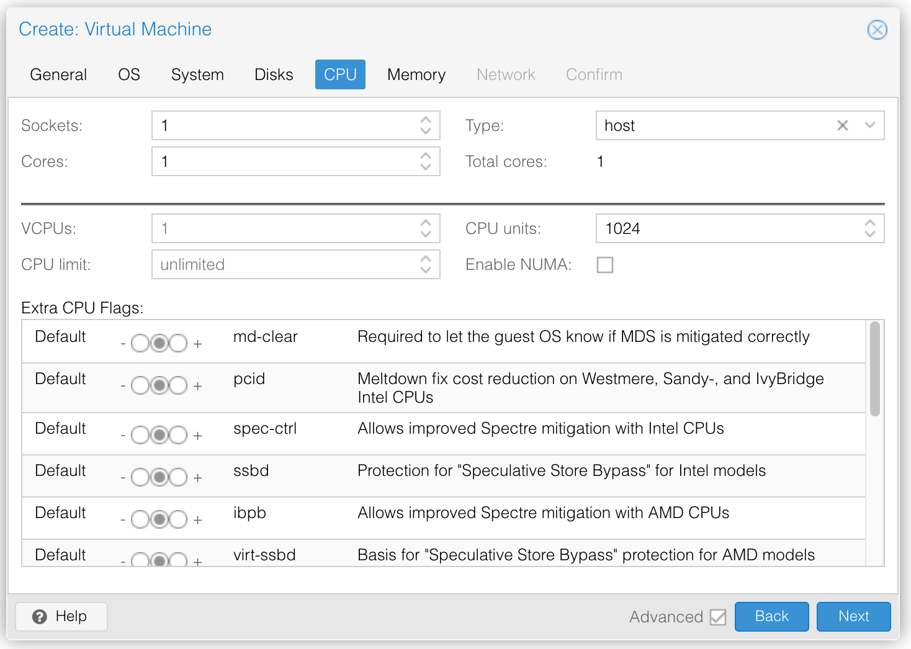

# Proxmox-based environment

This directory contains a set up Ansible playbooks for provisioning VMs intended for use with developing the Embedded Manetu.  They are an alternative to
the Vagrant based setup for cases where the Vagrant/Virtualbox setup is problematic.

It should be noted that the Vagrant based setup is far easier to use, and is thus recommended whenever possible.

One of the challenges with these playbooks is the require extra care and feeding compared to the relatively turn-key Vagrantfile based approach, including:

* Having access to one or more Proxmox clusters with enough spare resources
* Creating API-TOKEN based credentials to the proxmox cluster
* Creating a Ubuntu 22.04-based base-image template with the requisite ssh public keys

All of these items are out of scope for this document.  In addition to the above, another challenge is that currently these playbooks require a few different phases:

* Running the create.yml playbook to create the initial VMs
* Manually determining the IP addresses assigned to the VMs and updating the 'worker' inventory
* Running a second playbook to finalize provisioning, such as setting the proper hostname.

However, once the above has been achieved, we can snapshot the VMs so that we can easily reset the environment with one command.  So, while initial setup is more painful than Vagrant, the developer experience for iterating is arguable better because we can restore all the VMs to their baseline snapshot with one command in a much shorter timeframe when compared to 'vagrant up'.

## Environment Setup

### Create a VM Template

#### Set up a VM for templating

##### Proxmox VM setup

- A meager VM will do for templating, as the playbook can adjust the resources during setup.  Recommended settings are:
    - 1 CPU (1 Socket, 1 Core)
        - Be sure to select "Host" (See Figure 1) as the CPU type or YB will not work
    - 4GB Ram
    - Leave BIOS/Display/Machine as defaults
    - 200G storage via Virtio SCSI


_Figure 1: CPU Selection should be set to "Host"_

##### OS Install

- Install Ubuntu 22.04 "Minimal Server" from ISO, enabling OpenSSH server
- Run apt-get update/upgrade, reboot
- Reset hostname with 'hostnamectl set-hostname base-worker'
- Install vim
- Run visudo to add your account to passwordless sudo
    - e.g. add 'ghaskins ALL = (ALL) NOPASSWD: ALL'
- ssh-copy-id your SSH keys
- Reset cloud-init

#### Reset cloud-init notes

``` shell
echo "" > /etc/machine-id
cloud-init clean
```

You may find this link helpful: https://docs.technotim.live/posts/cloud-init-cloud-image/

#### Clone VM as "base-worker" template

#### Create a Proxmox API-Token

- Go to Datacenter -> Permissions -> API Tokens
- Create a new API token for 'root@pam'
  - Assign and retain a Token Name, e.g. "ansible"
  - Uncheck 'Privilege Separation'

Retain the User Name, Token Name and Token Value for the 'pve_api_user', 'pve_token_id' and 'pve_token_secret', respectively, in the next section

### Create an inventory based on your Proxmox clusters, like so

``` yaml
proxmox:
  hosts:
    pve.haskins.net:
      pve_api_user: root@pam
      pve_token_id: ansible
      pve_token_secret: xxxxxxxxxxxx
      pve_clone_id: base-worker
      vms:
        - {name: node-1, node: pve}
        - {name: node-2, node: pve}
    pve2.haskins.net:
      pve_api_user: root@pam
      pve_token_id: ansible
      pve_token_secret: xxxxxxxxxxxx
      pve_clone_id: base-worker
      vms:
        - {name: node-3, node: pve2}
```

From here, we create the base VMs with the following command

``` shell
ansible-playbook setup/proxmox/create.yml -i my-proxmox-inventory.yml
```

We must then manually gather the DHCP-assigned IPs to each of the VMs (TODO: offer static assignment?)

Using these addresses, add a new 'worker' pool to the inventory, as so:

``` yaml
workers:
  hosts:
    node-1:
      ansible_host: 10.20.32.40
    node-2:
      ansible_host: 10.20.32.42
    node-3:
      ansible_host: 10.20.32.41
```

Where the hostname var matches the names assigned in the 'vms' section.  Next, apply the init-hosts playbook to update the VMs.

``` shell
ansible-playbook setup/proxmox/init-hosts.yml -i my-proxmox-inventory.yml
```

From here, we have our core set of machines and should establish a snapshot that we can conveniently restore to if we need to iterate testing.

``` shell
ansible-playbook setup/proxmox/snapshot.yml -i my-proxmox-inventory.yml
```

## Use

You may now take this set of IP addresses and create a suitable inventory for use with the real deployment playbooks.

``` yaml
all:
  hosts:
    node-1:
      ansible_host: 10.20.32.34
    node-2:
      ansible_host: 10.20.32.35
    node-3:
      ansible_host: 10.20.32.36
  vars:
    k3s_primary_host: 10.20.32.34
    ...

k3s_primary:
  hosts:
    node-1:

k3s_secondary:
  hosts:
    node-[2:3]:
```

## Environment Reset

If you ever want to reset the system back for testing, use the restore.yml playbook, like so:

``` shell
ansible-playbook setup/proxmox/restore.yml -i my-proxmox-inventory.yml
```

followed by

``` shell
ansible-playbook setup/proxmox/start.yml -i my-proxmox-inventory.yml
```

## Environment Tear-down

When you no longer need the environment:

``` shell
ansible-playbook setup/proxmox/delete.yml -i my-proxmox-inventory.yml
```
